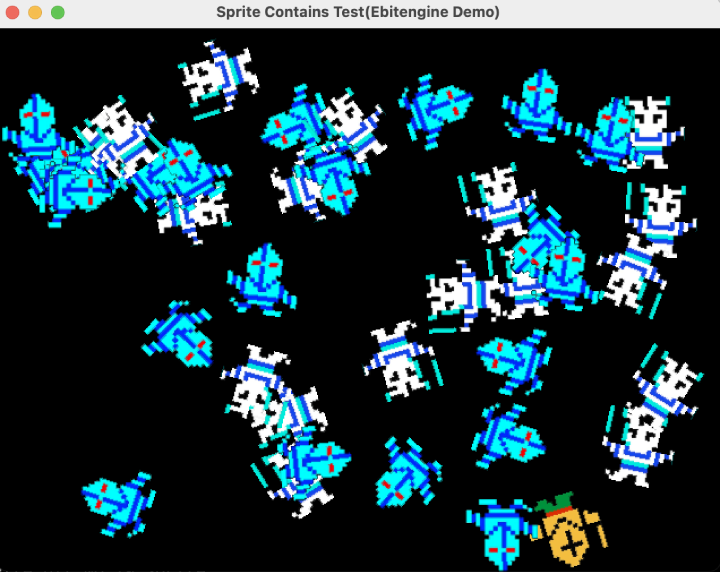
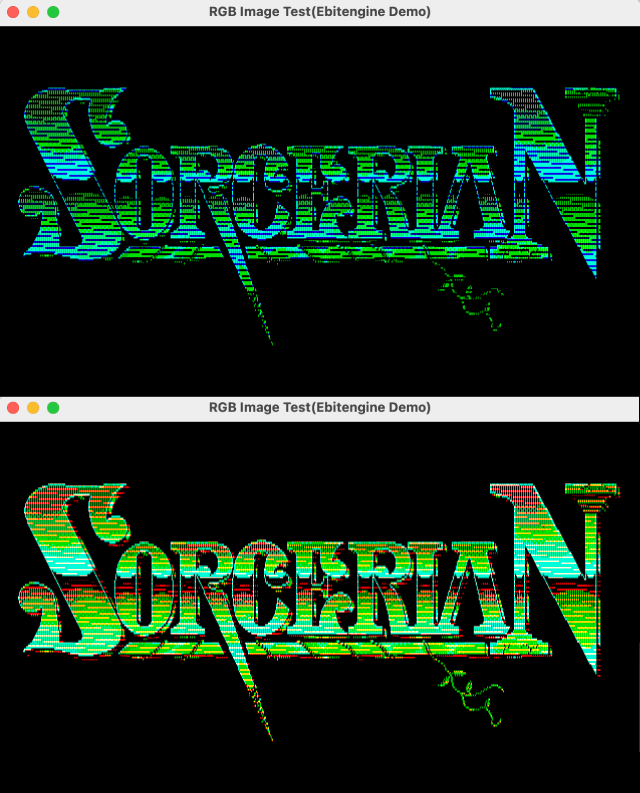

# Golang Game Engine Ebitengine

## 当たり判定スプライトライブラリ

当たり判定、クリック判定を実装したスプライトライブラリ

### [sprite](https://github.com/BakuretuKen/Ebitengine/tree/main/sprite)

[](https://github.com/BakuretuKen/Ebitengine/tree/main/sprite)

スプライト作成
```go
spriteSheet, err = LoadEbitenImage("assets/icon.png")
sprite := NewSprite(spriteSheet, 2) // 2は画像のフレーム数（画像は横並び）
```

当たり判定領域設定（パーセント指定）
> sprite.hitArea = 80 // パーセント指定

クリック判定
> func (s *Sprite) Contains(x, y int) bool

他のスプライトとの当たり判定
> func (s *Sprite) IsHitWith(other *Sprite) bool

画像アニメーション速度設定（アニメフレーム数、ループ有無）
> func (s *Sprite) SetAnimeSpeed(speed int, loop bool)

## Windows データ保存ライブラリ

Windows のユーザーデータ保存（AppData）を使ったデータ保存ライブラリ

### [appdata](https://github.com/BakuretuKen/Ebitengine/tree/main/appdata)

データ保存

```go
SetAppDirName("BakuretuKenGame")
err := SaveGameData("save.json", "Hello Sofmap World")
if err != nil {
	log.Fatal(err)
}
```

データ読み込み

```go
SetAppDirName("BakuretuKenGame")
data, err := LoadGameData("save.json")
if err != nil {
	log.Fatal(err)
}
fmt.Println(data)
```

## 画像RGB描画ライブラリ

PC8801、PC9801風 VRAMドット転送画像描画・削除ライブラリ

### [rgbimage](https://github.com/BakuretuKen/Ebitengine/tree/main/rgbimage)

[](https://github.com/BakuretuKen/Ebitengine/tree/main/rgbimage)<br />
<small>使用画像 © Nihon Falcom Corporation/日本ファルコム</small>


RGB表示画像生成関数<br />
reverse=true の場合は、削除処理になります。
> func NewRgbImage(src *ebiten.Image, reverse bool) *RgbImage

描画開始関数<br />
waitFrame は、フレーム毎の作画ウエイトを設定します。
> func (r *RgbImage) StartDraw(waitFrame int)

## その他

Ebitengine 公式サイト<br />
**https://ebitengine.org/ja/**

